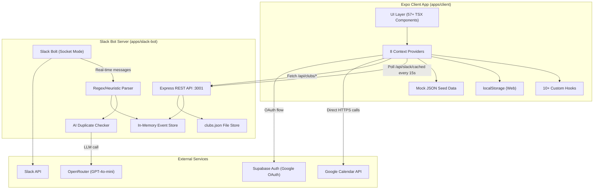

# Universify (CMUnify) -- Complete Project Overview

## 1. Project Identity and Elevator Pitch

**Universify** (branded as **CMUnify** in the landing page UI) is a cross-platform university event discovery and calendar platform built for Carnegie Mellon University students. It aggregates events from multiple sources -- Slack channels, Google Calendar, manual creation, and (planned) Instagram, Discord, and newsletters -- into a single unified feed with personalized recommendations, calendar integration, and club management.

**Problem Statement:**
Students at CMU consistently miss casual, small-scale community activities because the current landscape is fragmented across rigid club listservs, massive GroupMe/Discord channels, and scattered social media posts. There is no centralized, time-and-location-centric tool for discovering spontaneous events that match a student's schedule and interests.

**Target Audience:**
- Primary: CMU undergraduate and graduate students who want flexible, lightweight ways to meet people and discover events.
- Secondary: Student club leaders who want to expand their event reach beyond their own communication channels.

**Core Concept:**
A "decentralized broadcasting system" for student-driven activities -- unlike club-admin-controlled platforms, Universify is time/location-centric and focuses on both organized club events and casual social activities (pickup basketball, study groups, poker nights). Think of it as a campus-wide spontaneous hangout board that replaces the noise of giant group chats.

**Repository:** [github.com/Hef50/Universify](https://github.com/Hef50/Universify)
**Team:** 3 contributors (Haresh Muralidharan, Hyeonji Ahn, Sam Ethan Mathew)
**Origin:** Built for the Labrador Hacks Idea-a-thon at CMU, evolved into a multi-semester project.
**YouTube Demo:** [youtu.be/02Ed_CcxVGY](https://youtu.be/02Ed_CcxVGY)

---

## 2. Architecture Overview

### Monorepo Structure

Universify is a **pnpm monorepo** (pnpm 10.18.3) with two applications:

```
Universify/
├── apps/
│   ├── client/          # Expo (React Native) cross-platform app
│   └── slack-bot/       # Node.js Slack bot + REST API server
├── package.json         # Root workspace config
├── pnpm-workspace.yaml  # Workspace: apps/*
└── pnpm-lock.yaml       # Lockfile v9
```

There is no `packages/` directory -- shared code lives within `apps/client` (types, utils, hooks, contexts). No Turborepo or build orchestration tool is used.

### Data Flow



### How the Two Apps Communicate

The Expo client talks to the Slack bot server via HTTP REST calls to `localhost:3001`. The Slack bot serves two roles:
1. **Event ingestion:** Listens to Slack channels in real-time (Socket Mode) or on-demand (REST import), parses messages into structured events using regex heuristics, optionally checks for duplicates via an LLM, and stores them in memory.
2. **Club management:** CRUD operations for clubs with password-protected joining, stored in a JSON file.

The client also talks directly to:
- **Google Calendar API** (via provider tokens from Supabase OAuth) for reading and creating calendar events.
- **Supabase Auth** for Google OAuth sign-in.

---

## 3. Tech Stack

### Client App (`apps/client`)

| Layer | Technology | Version |
|-------|-----------|---------|
| Framework | Expo (React Native) | SDK ~54.0.20 |
| Runtime | React Native | 0.81.5 |
| UI Library | React | 19.1.0 |
| Router | Expo Router (file-based) | ~6.0.13 |
| Language | TypeScript | ~5.9.2 |
| Animations | React Native Reanimated | ~4.1.1 |
| Auth | @supabase/supabase-js + auth-helpers-react | Latest |
| Navigation | @react-navigation/* | Latest |
| Icons | @expo/vector-icons (Material Icons) | ^15.0.3 |
| Web Support | react-native-web | Latest |
| Fonts | expo-font | Latest |
| State Management | React Context API (8 providers) | N/A |
| Persistence | localStorage (web) | N/A |

### Slack Bot (`apps/slack-bot`)

| Layer | Technology | Version |
|-------|-----------|---------|
| Slack SDK | @slack/bolt | ^4.1.0 |
| Slack Web API | @slack/web-api | ^7.8.0 |
| HTTP Server | Express | ^4.21.2 |
| AI/LLM | OpenRouter API (GPT-4o-mini) | N/A |
| Language | TypeScript | ~5.9.2 |
| Runtime | ts-node (dev), node (prod) | Latest |
| Environment | dotenv | ^16.4.7 |

### Infrastructure

| Aspect | Status |
|--------|--------|
| Package Manager | pnpm 10.18.3 |
| Monorepo Tool | None (pnpm workspaces only) |
| CI/CD | None |
| Testing | None |
| Deployment | Not deployed (localhost only) |
| Database | localStorage + JSON files (no SQL/ORM) |

---

## 4. Implemented Features (Detailed)

### 4.1 Authentication System

**Files:** `hooks/useAuth.ts`, `contexts/AuthContext.tsx`, `contexts/GoogleAuthContext.tsx`, `app/(auth)/login.tsx`, `app/(auth)/signup.tsx`

Two auth pathways are implemented:

**Local Mock Auth:**
- Login/signup forms with `.edu` email validation.
- Password strength indicators with animated checkmarks (min length, uppercase, number, special char).
- Users stored in `localStorage` (`universify_auth`, `universify_users`), seeded from `mockUsers.json`.
- Credentials matched against in-memory user list -- prototype-grade, not a real backend.
- 3 demo accounts: `demo@cmu.edu` / `Demo123!`, `student@andrew.cmu.edu` / `Student123!`, `test@stanford.edu` / `Test123!`.

**Google OAuth (via Supabase):**
- `signInWithOAuth({ provider: 'google' })` through Supabase client.
- Session management via `supabase.auth.onAuthStateChange`.
- Provider token persisted on web under `universify_google_auth`.
- On successful Google auth, a `User` object is constructed from Supabase user metadata.

**Route Protection:**
- Tab layout (`(tabs)/_layout.tsx`) checks `isAuthenticated` (local OR Google) and redirects to login if false.
- Client-side only; no server middleware.

### 4.2 Calendar System

**Files:** `components/calendar/CalendarWithRecs.tsx`, `WeekView.tsx`, `CalendarHeader.tsx`, `TimeColumn.tsx`, `EventDisplayCard.tsx`, `utils/eventLayout.ts`, `utils/dateHelpers.ts`

A Google Calendar-style weekly view with substantial depth:

- **Full 24-hour view** (12 AM - 11 PM) with auto-scroll to 7 AM on mount.
- **Configurable day range:** 1-15 days visible (default 7 desktop / 3 mobile), user-settable in preferences.
- **Overlapping event layout algorithm:** Ported from a separate Vite-based CalFrontend prototype. Calculates column positions for overlapping time blocks, rendering them side-by-side like Google Calendar.
- **Drag-to-create events:** Click and drag on empty calendar space to select a time block. Shows a dashed-border visual preview. Automatically navigates to the create event page with pre-filled start/end times.
- **Event blocks:** Sized proportionally by duration, positioned by start time, color-coded per event.
- **Time navigation:** Previous/next week buttons, "Today" jump button.
- **Resizable recommendations sidebar** on desktop: Drag to resize the right-hand panel showing recommended events alongside the calendar.
- **Click-to-view:** Click any event block to see details in a sidebar.

### 4.3 Google Calendar Integration

**Files:** `contexts/GoogleCalendarContext.tsx`, `lib/googleCalendar.ts`

Two-way integration with Google Calendar via direct API calls:

**Reading events:**
- Fetches from `calendar/v3/calendars/primary/events` with `timeMin` (now) to `timeMax` (now + 28 days).
- Events cached in `localStorage` (`universify_google_events`) with a last-sync timestamp.
- Auto-syncs when cache is older than 5 minutes.
- Converts Google events to Universify `Event` format (ids prefixed `gcal-`), including category extraction from keywords and Google colorId mapping to hex.

**Creating events:**
- Posts to `calendar/v3/calendars/primary/events` with summary, description, start/end dateTime (local timezone), and optional location.
- Skips events whose id already starts with `gcal-` (avoids re-creating Google-sourced events).
- Triggers a resync 1 second after creation.

**Deleting events:**
- Calls DELETE on `calendar/v3/calendars/primary/events/{id}` (strips `gcal-` prefix). Treats 404 as success.

**Week-scoped queries:**
- `getGoogleEventsForWeek` filters cached events by overlap with a given week.
- `getGoogleEventsForDateRange` makes a live API call for arbitrary date ranges.

### 4.4 Event Discovery

**Files:** `app/(tabs)/find.tsx`, `components/events/EventCard.tsx`, `components/events/EventDetailSidebar.tsx`, `components/layout/FilterDrawer.tsx`, `utils/eventHelpers.ts`, `contexts/FilterContext.tsx`

Rich discovery interface with multiple search and filter modes:

**Search (3 modes):**
1. **Names Only:** Matches search text against event titles.
2. **All Fields:** Matches against title, description, location, tags, categories, and organizer name.
3. **Semantic:** Weighted token scoring across fields (not true vector embeddings -- uses term frequency heuristics). Production note in code mentions future embeddings/LLM implementation.

**Filters:**
- Quick filter pills for each of the 12 event categories.
- Advanced filter drawer with: categories (multi-select), club/social event toggles, date range, location substring, time-of-day buckets (morning/afternoon/evening/night), capacity filter.
- "My Events" filter to show only events created by the current user.
- Clear button resets all filters at once.

**Display:**
- Grid view (3 columns on desktop) / List view toggle.
- Event cards showing title, time, location, categories, RSVP counts, capacity indicator.
- Animated detail sidebar (slides in from right on desktop, bottom sheet on mobile) with full event info.
- Sorting options: by date, popularity (RSVP count), or recency.

### 4.5 Event Creation

**Files:** `app/(tabs)/create.tsx`, `components/events/CreateEventForm.tsx`

Comprehensive event creation form:

- **Required fields:** Title, description, start/end date and time, location.
- **Category selection:** Multi-select from 12 categories (Career, Food, Fun, Afternoon, Events, Academic, Networking, Social, Sports, Arts, Tech, Wellness).
- **Color picker:** Choose a hex color for calendar display.
- **RSVP settings:** Enable/disable RSVP, set attendee visibility (public/private).
- **Event type toggles:** Club event vs. social event.
- **Capacity limits:** Optional max attendee count.
- **Recurring events:** Frequency (daily/weekly/monthly), interval, end date, specific days of week.
- **Tags:** Free-form tag input.
- **Real-time validation** on all fields.
- After creation, auto-redirects to the Find page with "My Events" filter active.
- Also triggerable from **drag-to-create** on the calendar (pre-fills times).

### 4.6 Recommendation Engine

**Files:** `hooks/useRecommendations.ts`

A client-side recommendation system with several algorithmic layers:

**Interest Analysis (`analyzeEvents`):**
- Builds tag n-grams (1-3 word combinations) from event titles.
- Counts category frequencies across all events.
- Buckets events into time-of-day preferences (morning/afternoon/evening/night based on UTC hours).
- Weights by engagement: `log1p(rsvpCounts.going) + 1`.
- Supports optional date-range filtering.
- Returns ranked `tags`, `categories`, `times`, and merged `top` interests.

**Scoring (`getRecommendedEvents`):**
- Search token matches in event title: +2 points.
- Top interest label matches in title: +3 points.
- Returns sorted list.

**Time-Range Suggestions (`getSuggestionsForTimeRange`):**
- Filters events overlapping with a given time range.
- Interest match: +3, popularity boost (RSVP going), duration fit bonus.
- Returns top N suggestions.

**UI:**
- Recommendation cards with "Why recommended" tags explaining the match.
- Recommendation rail (horizontal scroll) and list layouts.
- Refresh button to get new recommendations.
- Integrated with filter context.

### 4.7 Profile and Settings

**Files:** `app/(tabs)/profile.tsx`, `app/settings/account.tsx`, `app/settings/preferences.tsx`, `app/settings/appearance.tsx`, `contexts/SettingsContext.tsx`

**Profile:**
- User stats: events created count, saved events count, interest categories.
- Links to settings sub-pages.
- Logout functionality.

**Account Settings:**
- Name, email, password change.

**Preferences:**
- Default home page (calendar vs. recommendations).
- Calendar view days (1-15).
- Category interests (multi-select).
- Notification preferences (email, push, event reminders, new events in categories) -- UI exists, not wired to backend.

**Appearance:**
- Theme selection (light/dark/system) -- settings stored, dark mode not fully implemented in components.
- Font size (small/medium/large).
- Accessibility toggles: high contrast, reduce motion.

### 4.8 Responsive Design

**Files:** `components/layout/DesktopNav.tsx`, `components/layout/ResponsiveLayout.tsx`, `components/layout/ResizableSidebar.tsx`, `hooks/useResponsive.ts`

Three-tier responsive design:

| Breakpoint | Layout |
|-----------|--------|
| < 768px (mobile) | Bottom tab navigation, single-column layouts, stacked components, touch-friendly button sizes |
| 768-1024px (tablet) | 2-column grids, larger touch targets, more spacing |
| > 1024px (desktop) | Top horizontal navigation bar (DesktopNav), 3-column grids, sidebars for filters and recommendations, hover states, max-width containers |

- Desktop nav bar replaces mobile bottom tabs (hidden via `tabBarStyle: { display: 'none' }`).
- DesktopNav includes: logo/brand, navigation items with active state indicators, user profile section with avatar, logout button.
- ResizableSidebar: Drag-to-resize recommendation panel on calendar page.

### 4.9 Animations

**Files:** `app/index.tsx` (landing), `components/events/EventCard.tsx`, multiple others

Extensive animation system using React Native's Animated API:

**Landing Page:**
- Animated hero section with fade-in, slide-up, and scale animations.
- Floating background circles with continuous animation.
- Feature cards with staggered entrance animations.
- Animated statistics counter section.
- Testimonials with fade-in effects.
- CTA buttons with hover effects.
- Trust badges and social proof elements.

**Event Cards:**
- Fade-in on mount.
- Slide-up with spring physics.
- Scale animation for depth effect.
- Staggered entrance based on card index (50ms delay per card).
- Press-down scale on touch, spring back on release.
- Smooth transitions when filtering changes the visible set.

**Performance:** All animations use `useNativeDriver: true` for 60fps rendering.

### 4.10 Slack Integration (Client Side)

**Files:** `contexts/SlackContext.tsx`, `lib/slack.ts`

The client connects to the Slack bot's REST API:

- **Health check:** `GET /api/slack/health` to verify bot is running.
- **Channel listing:** `GET /api/slack/channels` to show available Slack channels.
- **Channel selection:** User picks which channels to monitor; config persisted in `localStorage` (`universify_slack_config`).
- **Event import:** `GET /api/slack/events?channel={id}&limit=50` for on-demand import from selected channels.
- **Auto-polling:** `EventsContext` polls `GET /api/slack/cached` every 15 seconds and merges converted events (ids prefixed `slack-`) into the main event list.
- **Clear imported:** Remove all Slack-sourced events from the feed.
- **Auto-import setting:** Option to automatically import on app launch if channels are selected.

### 4.11 Slack Bot (Server Side)

**Files:** `apps/slack-bot/src/index.ts`, `listener.ts`, `actions.ts`, `routes.ts`, `parser.ts`, `store.ts`

A dual-mode server running Express + Slack Bolt:

**Real-Time Listening (Socket Mode):**
- `app.message` handler processes every message with text in all channels (monitored channel filtering is implemented but the monitored set is never populated, so all channels are processed).
- Resolves channel name and user display name via Slack API.
- Parses message text through the regex/heuristic parser.
- Optionally runs AI duplicate detection.
- Stores parsed event in a pending map.
- Sends an ephemeral message to the poster with **Approve / Reject** block kit buttons.
- `approve_event` action moves the event from pending to the in-memory store.
- `reject_event` action discards it.
- Pending events have a 30-minute TTL.

**REST API Import:**
- `GET /api/slack/events?channel={id}` fetches `conversations.history`, parses each message, and adds all successfully parsed events directly to the store (no approval step on this path).

**Message Parser (`parser.ts`):**
No LLM involved -- pure regex and heuristics:
- **Title:** First non-empty line (max 100 chars).
- **Date:** Matches `MM/DD/YYYY`, `MM-DD-YYYY`, or month name patterns; defaults to tomorrow if no date found.
- **Time:** Matches ranges like `3-5pm`, `3:00 PM - 5:00 PM`, or single times (defaults end = start + 1 hour).
- **Location:** Matches lines containing `Location:`, `Where:`, `at ...`, `@ ...`.
- **Categories:** Keyword buckets (e.g., "career", "food", "tech") or defaults to `Events`.
- **Event ID:** `slack-{channelId}-{message.ts}`.
- **Color:** Fixed Slack purple `#611f69`.
- **Tags:** Always includes `Slack` and the channel name.

### 4.12 AI Duplicate Detection

**Files:** `apps/slack-bot/src/duplicate-checker.ts`

When a new event is parsed from a real-time Slack message:

- Reads up to 30 existing events from the in-memory store.
- Sends a structured prompt to **OpenRouter** (`https://openrouter.ai/api/v1/chat/completions`) using model `openai/gpt-4o-mini` with `temperature: 0`.
- The prompt includes the new event's title, times, and location alongside summaries of existing events.
- Expects a JSON response: `{ isDuplicate, matchedEventId, matchedEventTitle, reason }`.
- If `OPENROUTER_API_KEY` is not set, duplicate checking is silently skipped (fail-open).
- On any API error or parse failure, also returns `{ isDuplicate: false }` (fail-open).

An additional endpoint `GET /api/openrouter/usage` proxies OpenRouter's `auth/key` and `models` endpoints for monitoring API key usage.

### 4.13 Club System

**Files:** `apps/slack-bot/src/club-routes.ts`, `club-store.ts`, `data/clubs.json`, `apps/client/contexts/ClubContext.tsx`, `lib/clubs.ts`, `app/(tabs)/clubs.tsx`, `types/club.ts`

Full club CRUD and membership management:

**Server-Side (Slack Bot):**
| Endpoint | Method | Behavior |
|----------|--------|----------|
| `/api/clubs` | GET | List all clubs; optional `userId` adds `isMember` flag |
| `/api/clubs` | POST | Create club with name, description, optional password, integrations, adminIds |
| `/api/clubs/:id` | GET | Club detail; integrations only visible to members |
| `/api/clubs/:id/join` | POST | Join with userId and optional password |
| `/api/clubs/:id/leave` | POST | Leave club |
| `/api/clubs/:id/members` | GET | Member list (admin-only, checked by userId query param) |
| `/api/clubs/admin/memberships` | GET | All clubs' memberIds (no auth gate -- dev/demo surface) |

- Clubs persisted in `data/clubs.json` via `fs.writeFileSync`.
- Seeds demo CMU-style clubs on first load if file is missing.
- Passwords stored in plain text (demo-grade).

**Client-Side:**
- `ClubContext` manages club list, loading state, join/leave operations.
- `ClubIntegration` type supports Slack, Discord, email, and website integrations per club.
- Membership data includes `memberIds` arrays.

**Data Model:**
```typescript
interface Club {
  id: string;
  name: string;
  description: string;
  requiresPassword: boolean;
  memberCount: number;
  isMember: boolean;
  integrations: ClubIntegration[];  // slack, discord, email, website
  integrationTypes: IntegrationType[];
  createdAt: string;
}
```

### 4.14 Landing Page

**Files:** `app/index.tsx`

A marketing-style landing page (branded "CMUnify") shown to unauthenticated users:

- Animated hero section with tagline and CTA buttons.
- Feature showcase cards with staggered entrance animations.
- Statistics counter section (animated numbers).
- Testimonials with fade-in effects.
- Trust badges and social proof elements.
- Responsive layout for all breakpoints.
- Auto-redirects to `/(tabs)` if user is already authenticated.
- Color scheme: Primary coral red `#FF6B6B`, secondary purple `#8B7FFF`.

---

## 5. Data Layer Details

### TypeScript Type Definitions

**Event** (`types/event.ts`):
- 20+ fields including id, title, description, startTime/endTime (ISO 8601), location, categories (array of 12 possible values), organizer (id + name + type: club|individual), color (hex), rsvpEnabled, rsvpCounts (going/maybe/notGoing), attendees (array with userId + status + timestamp), attendeeVisibility (public/private), isClubEvent, isSocialEvent, capacity, recurring (RecurringPattern), tags, createdAt, updatedAt, imageUrl.

**User** (`types/user.ts`):
- Fields: id, email, name, university, profilePicture, preferences (categoryInterests, eventTypePreferences, defaultRSVPVisibility, notificationPreferences), settings (theme, defaultHomePage, calendarViewDays, colorScheme, fontSize, accessibility), savedEvents, createdEvents, createdAt, lastLogin.

**Club** (`types/club.ts`):
- Fields: id, name, description, requiresPassword, memberCount, isMember, integrations (array of ClubIntegration), integrationTypes, createdAt.

### Event Categories (12)

Career, Food, Fun, Afternoon, Events, Academic, Networking, Social, Sports, Arts, Tech, Wellness.

### Persistence

| Data | Storage | Persistence |
|------|---------|-------------|
| Main events (base + user-created) | localStorage `universify_events` | Survives page reload (web only) |
| Slack events (cached) | localStorage `universify_slack_events` | Survives page reload (web only) |
| Google Calendar events | localStorage `universify_google_events` | Survives page reload, 5-min TTL |
| Auth state | localStorage `universify_auth` | Survives page reload (web only) |
| User database | localStorage `universify_users` | Seeded from mockUsers.json |
| Slack config | localStorage `universify_slack_config` | Survives page reload (web only) |
| Settings/preferences | SettingsContext (localStorage) | Survives page reload (web only) |
| Slack bot events | In-memory Map (apps/slack-bot) | Lost on process restart |
| Clubs | JSON file (apps/slack-bot/data/clubs.json) | Survives restart |
| Pending approvals | In-memory Map, 30-min TTL | Lost on restart |

### Seed Data

- `mockEvents.json`: 40+ diverse events across all 12 categories.
- `currentWeekEvents.json`: 10 events for a specific week (Nov 17-22, 2025) including Morning Yoga, CS Study Group, Basketball Pickup, Tech Talk, Coffee & Code, Poker Night, Design Workshop, Lunch & Learn, Movie Night, Hackathon Kickoff.
- `mockUsers.json`: 5 test accounts with varied preferences.
- `categories.json`: 12 category definitions.

### Supabase Schema (Documented, Not Fully Wired)

An `events` table schema exists in `DATABASE_SETUP.md`:
```sql
CREATE TABLE events (
  id TEXT PRIMARY KEY,
  title TEXT NOT NULL,
  description TEXT,
  start_time TIMESTAMPTZ NOT NULL,
  end_time TIMESTAMPTZ NOT NULL,
  location TEXT,
  categories TEXT[],
  organizer_id TEXT,
  organizer_name TEXT,
  organizer_type TEXT,
  color TEXT,
  rsvp_enabled BOOLEAN DEFAULT true,
  rsvp_counts JSONB,
  attendees JSONB,
  attendee_visibility TEXT,
  is_club_event BOOLEAN DEFAULT false,
  is_social_event BOOLEAN DEFAULT false,
  capacity INTEGER,
  recurring JSONB,
  tags TEXT[],
  image_url TEXT,
  created_at TIMESTAMPTZ DEFAULT NOW(),
  updated_at TIMESTAMPTZ DEFAULT NOW()
);
```

The `lib/api.ts` file has placeholder functions that throw "API not implemented - using localStorage" -- the Supabase data layer is designed but not connected.

---

## 6. Unimplemented / Planned Features

These features are documented in the Master Document, README, and code comments but have not been built:

### High Priority (Core Product Gaps)

| Feature | Description | Documented In |
|---------|-------------|---------------|
| **Real Supabase Backend** | Wire events, users, and RSVPs to Supabase Postgres tables instead of localStorage | DATABASE_SETUP.md, README |
| **CMU SSO Authentication** | Shibboleth/SAML or OAuth restricted to `@andrew.cmu.edu` emails | Master Document |
| **Production Deployment** | Deploy to any hosting platform (no deployment pipeline exists) | Master Document |
| **Real-Time Updates** | WebSocket/Supabase Realtime subscriptions for live event feeds | README |
| **Push Notifications** | Expo push + email (Resend/SES) for event reminders and updates | Master Document |
| **Testing Suite** | No unit, integration, or E2E tests exist anywhere in the codebase | N/A |
| **CI/CD Pipeline** | No automated builds, linting, or deployment pipeline | N/A |

### Medium Priority (Feature Expansion)

| Feature | Description |
|---------|-------------|
| **Instagram Scraping + LLM Parsing** | Scrape club Instagram posts, run through GPT to extract event details automatically. Identified as "biggest technical risk" in docs due to Instagram's lack of public API. |
| **Discord Bot Integration** | Mirror the Slack bot functionality for Discord servers. |
| **Newsletter/Canvas Integration** | Ingest events from university newsletters and Canvas LMS. |
| **Semantic Search with Embeddings** | Replace the current weighted-token scoring with actual vector embeddings for true semantic similarity. Code has production notes marking where to add this. |
| **ML-Based Recommendations** | Replace heuristic scoring with trained recommendation models using user behavior data. |
| **Map View** | Interactive map with location pins (Mapbox or Google Maps) showing event locations. |
| **Per-Event Chat** | Lightweight, ephemeral group chat within each event (Supabase Realtime). Auto-expires after event ends. |
| **Social Features** | Friend system (add/remove, close friends), friend activity feed, "friends going" highlight on events. |
| **Admin/Moderation Panel** | Flag queue, event freeze/delete, user muting/banning, anti-spam rate limiting. |
| **Dark Mode** | Settings UI exists with theme toggle, but dark styles are not fully implemented across components. |

### Lower Priority (Nice-to-Haves)

| Feature | Description |
|---------|-------------|
| **Event Check-In QR Codes** | Generate QR codes for event attendance tracking. |
| **Event Photos/Media** | Photo uploads and post-event recap albums. |
| **Comments and Reviews** | User-generated comments on events. |
| **Analytics Dashboard** | DAU/WAU, events posted vs joined, fill rates, show-up proxies, time-to-first-join. |
| **Tutorial/Onboarding Flow** | Guided walkthrough for new users. Sprint planning docs mention this as an active task. |
| **Smart Matching** | "I'm free 3-6pm" availability input that auto-suggests matching events. Recurring availability auto-suggest for weekly groups. |
| **Skill Ratings** | Casual vs competitive ratings for sports/gaming activities. |
| **Venue Integrations** | CMU-specific venue data (Skibo courts, UC game rooms, etc.). |
| **ICS Calendar Export** | Generate .ics files for non-Google calendar users. |
| **Event Reputation System** | No-show tracking, implicit ratings, host reputation scores. |
| **Location Privacy** | Round lat/lng to ~50m radius for user safety. |

---

## 7. Resume Value Assessment

### 7.1 Technical Skills Demonstrated

**Cross-Platform Mobile/Web Development:**
- Built a single codebase running on iOS, Android, and web using React Native (Expo SDK 54) with Expo Router for file-based navigation.
- Implemented responsive design with three distinct breakpoints and layout strategies.
- Used React Native Reanimated and the Animated API for 60fps animations with `useNativeDriver`.

**TypeScript and Modern React:**
- Full TypeScript coverage across 57+ component files, 8 context providers, and 10+ custom hooks.
- Complex state management architecture with 8 interconnected contexts (Auth, Events, Settings, Filter, Google, GoogleCalendar, Slack, Club).
- Advanced hook patterns: custom recommendation hooks with n-gram analysis, responsive layout hooks, calendar computation hooks.

**Third-Party API Integration (Multiple Services):**
- **Google Calendar API:** Direct REST calls for event CRUD, token management via Supabase OAuth, bidirectional sync with caching and TTL.
- **Slack Bot SDK:** @slack/bolt Socket Mode for real-time message handling, Block Kit interactive components (approve/reject buttons), ephemeral messages, conversations.history fetching.
- **Supabase Auth:** OAuth flow with Google provider, session management, provider token extraction.
- **OpenRouter/OpenAI API:** Structured prompt engineering for duplicate detection, JSON response parsing, fail-open error handling.

**Backend Development:**
- Express REST API with 12+ endpoints spanning events, clubs, and monitoring.
- Event-driven architecture: real-time Slack message processing pipeline (listen -> parse -> deduplicate -> approve/reject -> store).
- Regex/heuristic NLP: Date, time, location, and category extraction from unstructured Slack message text.

**Monorepo Architecture:**
- pnpm workspace configuration managing two independent apps with separate build pipelines.

**Data Modeling and State Normalization:**
- Designed rich data models (Event with 20+ fields, User with nested preferences, Club with integrations).
- Normalized data from 3+ sources (JSON seed, user-created, Slack-parsed, Google Calendar) into a unified event feed with source-prefixed IDs and deduplication.

### 7.2 System Design Skills

- **Multi-service architecture:** Client app communicating with a separate bot server and external APIs.
- **Polling-based real-time:** 15-second polling cycle for Slack event updates with efficient merge/replace logic.
- **Caching strategy:** Google Calendar events cached with 5-minute TTL, localStorage persistence for offline-capable web experience.
- **Approval workflow:** Pending event queue with TTL expiry, ephemeral UI for approve/reject, dual import paths (real-time with approval vs. REST bulk without).
- **Fail-open design:** AI duplicate detection gracefully degrades when API key is missing or calls fail.

### 7.3 Product and Domain Skills

- **Full product lifecycle:** From hackathon ideation (Labrador Hacks) through multi-sprint development with documented roadmaps and feature prioritization.
- **Event management domain:** RSVP system, capacity management, recurring events, multi-category taxonomy, organizer types.
- **Recommendation algorithms:** Built from scratch -- n-gram interest analysis, time-bucket preferences, engagement-weighted scoring, multi-signal ranking.
- **User preference modeling:** Category interests, event type preferences, notification settings, display preferences, accessibility options.

### 7.4 Soft Skills Evidence

- **Team collaboration:** 3-person team with role division (frontend, backend, design, recommendation algorithm).
- **Sprint planning:** Documented weekly sprints with assigned tasks per team member.
- **Presentation skills:** Created and delivered a pitch presentation with YouTube demo video.
- **Hackathon experience:** Built for the Labrador Hacks Idea-a-thon at CMU.
- **Documentation:** Multiple planning docs, analysis documents, setup guides, and implementation summaries.

### 7.5 Suggested Resume Bullet Points

1. **Architected and built Universify**, a cross-platform (iOS/Android/Web) university event discovery platform using React Native (Expo), TypeScript, and a pnpm monorepo, featuring a Google Calendar-style weekly view with drag-to-create, 3-mode search, and personalized recommendations.

2. **Integrated 4 external services** -- Google Calendar API (bidirectional sync), Slack Bot SDK (Socket Mode real-time message parsing), Supabase Auth (Google OAuth), and OpenRouter GPT-4o-mini (AI duplicate detection) -- normalizing data from multiple sources into a unified event feed.

3. **Built a Slack bot server** with Express and @slack/bolt that ingests unstructured channel messages, extracts event metadata via regex/heuristic NLP, runs LLM-based duplicate detection, and serves 12+ REST endpoints for a club management system.

4. **Implemented a client-side recommendation engine** using n-gram interest analysis, time-bucket preference modeling, and engagement-weighted scoring to surface personalized event suggestions from a pool of 40+ events across 12 categories.

5. **Designed responsive UI across 3 breakpoints** (mobile/tablet/desktop) with 57+ React Native components, 60fps animations (Reanimated + Animated API), drag-to-resize sidebars, and a configurable 1-15 day calendar view.

6. **Led a 3-person team** through multi-sprint development cycles with documented roadmaps, task assignments, and a pitch presentation at CMU's Labrador Hacks Idea-a-thon.

### 7.6 Strengths vs Gaps

**Strengths (What Makes This Stand Out):**
- Breadth of integration: Very few student projects touch Slack Bot SDK + Google Calendar API + LLM APIs + Supabase Auth in a single codebase.
- Cross-platform: Running on 3 platforms from one codebase is a meaningful engineering achievement.
- Recommendation engine: Even though heuristic, building one from scratch shows algorithmic thinking.
- Rich data modeling: 20+ field event types, nested user preferences, club integrations -- demonstrates real product thinking.
- UI polish: Animations, responsive breakpoints, drag-to-create, resizable sidebars -- this goes beyond typical student project UI.
- Real-time pipeline: The Slack message -> parse -> LLM deduplicate -> approve/reject -> store pipeline is a genuine event-driven system.

**Gaps (What's Missing for Full Impact):**
- **No deployment:** The project has never been deployed. Running only on localhost significantly limits demo-ability and credibility.
- **No tests:** Zero unit, integration, or E2E tests. Adding even basic test coverage would dramatically improve the project's professional presentation.
- **No CI/CD:** No automated pipeline for linting, testing, or deployment.
- **Mock persistence:** localStorage and JSON files instead of a real database. The Supabase schema is documented but not wired.
- **No production auth:** Using hardcoded demo accounts and plaintext club passwords.
- **Slack bot state is ephemeral:** Events are lost on restart (in-memory Map, no database).
- **Monitored channels never set:** The `addMonitoredChannel` function exists but is never called, so all channels are processed.
- **Hardcoded Supabase credentials:** URL and anon key are literals in source code, not environment variables.

### 7.7 Comparable Project Benchmarks

Compared to typical CS student projects:

| Dimension | Typical Student Project | Universify |
|-----------|------------------------|------------|
| Platforms | 1 (web only) | 3 (iOS, Android, Web) |
| External API integrations | 0-1 | 4 (Google Calendar, Slack, Supabase, OpenRouter) |
| Components/files | 10-20 | 57+ TSX components, 70+ source files |
| Data sources | 1 (own DB) | 4+ (JSON seed, user-created, Slack, Google Calendar) |
| AI/LLM usage | None or basic | Structured prompt engineering with JSON parsing |
| State management complexity | Single context or Redux | 8 interconnected contexts |
| Team size | Solo or pair | 3-person team with role division |
| Documentation | README only | 6+ docs (master doc, analysis, implementation summary, integration summary, database setup, README) |

This project is in the **top 10-20% of student projects by scope and complexity**, but the lack of deployment, testing, and a real backend keeps it from being a standout portfolio piece at its current stage.

### 7.8 Time Investment Recommendations for Career Planning

**High ROI (Do These First):**
1. **Deploy the app** (1-2 days): Host the Expo web build on Vercel/Netlify and the Slack bot on Railway/Render. Having a live URL transforms this from "I built a thing" to "Here, try it." This is the single highest-impact thing you can do.
2. **Wire Supabase backend** (2-3 days): The schema is already documented. Replace localStorage with real Supabase queries. This eliminates the biggest credibility gap.
3. **Add basic tests** (1-2 days): Even 10-15 unit tests for the parser, recommendation engine, and event helpers would show testing awareness.
4. **Fix hardcoded credentials** (30 minutes): Move Supabase URL/key to environment variables.
5. **Persist Slack bot events** (1-2 hours): Write events to Supabase or a SQLite file instead of in-memory Map.

**Medium ROI (Do These for Polish):**
6. **Add CI/CD** (1 day): GitHub Actions for lint + test + deploy on push to main.
7. **Implement dark mode** (1 day): The settings UI already exists; just needs the theme applied to components.
8. **Record a polished demo video** (1-2 hours): The existing YouTube video may be outdated. A clean 2-minute walkthrough is invaluable for applications.
9. **Complete the tutorial/onboarding** (1 day): Already planned in sprint docs.

**Low ROI (Skip or Defer):**
- Instagram scraping: High technical risk (against Instagram ToS), low career signal.
- Discord bot: Duplicates Slack bot work without new technical learning.
- ML recommendations: The heuristic engine is sufficient for a student project; real ML would require significant data.
- Map view, QR codes, comments: Feature breadth is already a strength; depth (deployment, tests, real backend) matters more now.

**Bottom Line for a Career Planner:**
Universify demonstrates strong breadth and technical ambition. The project's biggest weakness is that it lives entirely on localhost with mock data. Investing 5-7 focused days to deploy it with a real backend and basic tests would move this from a "promising prototype" to a "shipped product" -- a meaningful distinction on a resume and in interviews. The existing feature set is already impressive enough; prioritize finishing over expanding.
